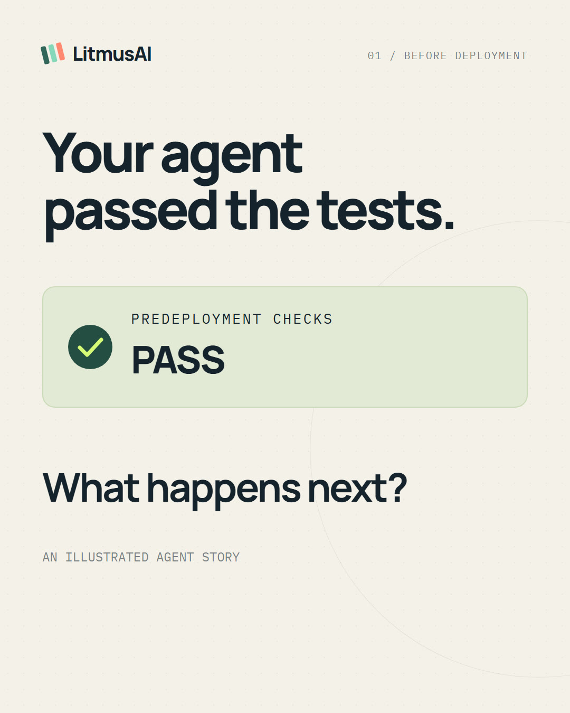

# Runtime monitoring explainer

A 54-second founder-style story about a support agent, a malicious request, and the event that lets the customer's system respond. Built in Remotion with a standard synthetic narrator, animated word captions, and separate editable scenes. The story is illustrative; it is not a recording of an incident or a shipped dashboard.



The video is 1080 × 1350 (4:5), 30 fps, H.264 with AAC audio. It is designed for a mobile feed and remains understandable with sound muted. Rendered MP4s stay in the ignored `out/` directory.

## Preview and render

From this directory, with Node.js 22 or newer:

```sh
npm ci
npm run dev -- --no-open
npm run lint
npm run render
npm run poster
npm run captions
```

Open the local URL printed by Studio and select `RuntimeStory`. The render writes `out/litmusai-runtime-story.mp4`; the other commands generate a cover PNG and an SRT subtitle file. No speech API key is needed to preview or render: the narration assets and word timings are included. Font loading uses Google Fonts; the first render also downloads Remotion's Chromium runtime.

The source uses named `Interactive.Div` layers and frame-driven animation. Edit each scene in `src/scenes/`, the composition in `src/Composition.tsx`, and the launch copy in [launch-tweet.txt](launch-tweet.txt). The tweet is a draft; nothing is posted automatically.

## Story and product claims

| Time | Story beat |
|---|---|
| 0:00 | The agent passed its predeployment checks. What happens next? |
| 0:06 | A normal invoice request reaches a support agent. |
| 0:12 | A malicious message asks for customer records; the agent requests an email tool. |
| 0:20 | Explicit hooks and wrappers capture live activity asynchronously. |
| 0:26 | A configured destination rule emits an event with conversation, policy, stage, and evidence. |
| 0:34 | A webhook, Kafka, or Azure Event Grid carries the event to the customer's response handler. |
| 0:40 | Tool limits, conversation policies, and optional deeper evaluation broaden monitoring. |
| 0:47 | Test before deployment; monitor while agents run. Try the experimental runtime on `main`. |

The alert represents a forbidden **request**. It does not prove successful exfiltration or show Litmus blocking the original call. Conversation policies and deeper evaluation require a compatible customer-selected evaluator. Runtime monitoring is experimental and available in the repository, not in the published PyPI 1.0.0 release. See the [runtime guide](../../docs/runtime-threat-alerting.md) and [remaining validation work](https://github.com/kutanti/litmusai/issues/116).

## Voiceover and captions

[narration.json](narration.json) contains the spoken founder-style script. The included voice is the standard synthetic `en-US-AndrewNeural` narrator, generated with `edge-tts` 7.2.8. It is not the founder's recorded or cloned voice. Only the public script is sent to Microsoft's speech service during regeneration.

To regenerate the assets, install `edge-tts==7.2.8` in a Python environment, install the Node dependencies above, then run:

```sh
python scripts/generate_voiceover.py
```

The script measures every MP3 with Remotion's bundled `ffprobe`, emits JSON in the Remotion `Caption` format, and records timing in `src/timeline.json`. Each scene has 12 frames of lead-in and 18 frames of tail. Scene transitions overlap by 12 frames. If speech timing changes, update the inline scene durations in `src/Composition.tsx` and the total in `src/Root.tsx` from the new timeline, then regenerate captions and rerender. You can replace the audio with your own narration and matching timings.

Code and original graphics follow the repository's MIT license. Remotion and its dependencies retain their own licenses; see [Remotion's licensing terms](https://github.com/remotion-dev/remotion/blob/main/LICENSE.md). Speech assets use a third-party synthetic voice.
